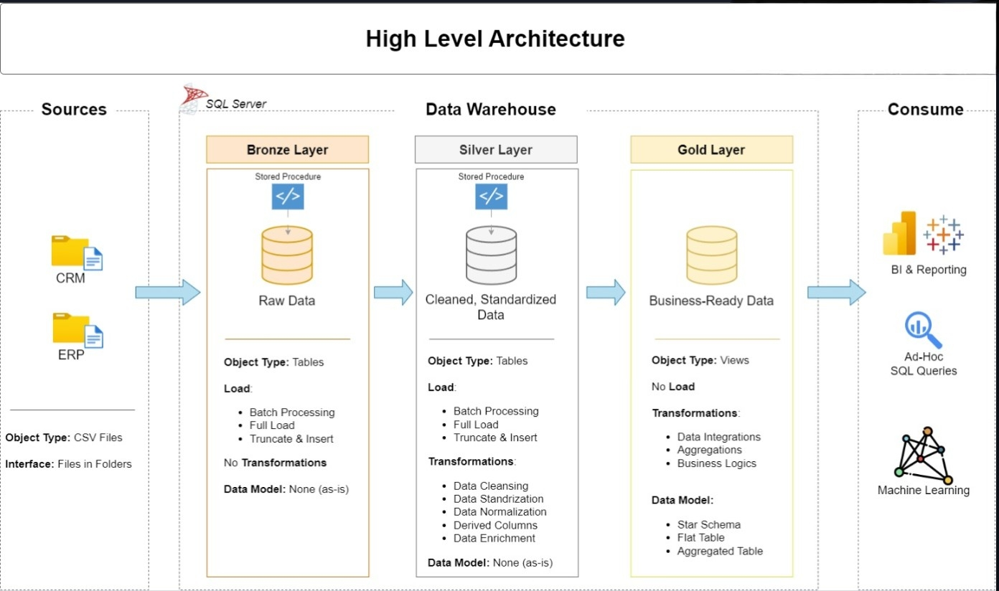
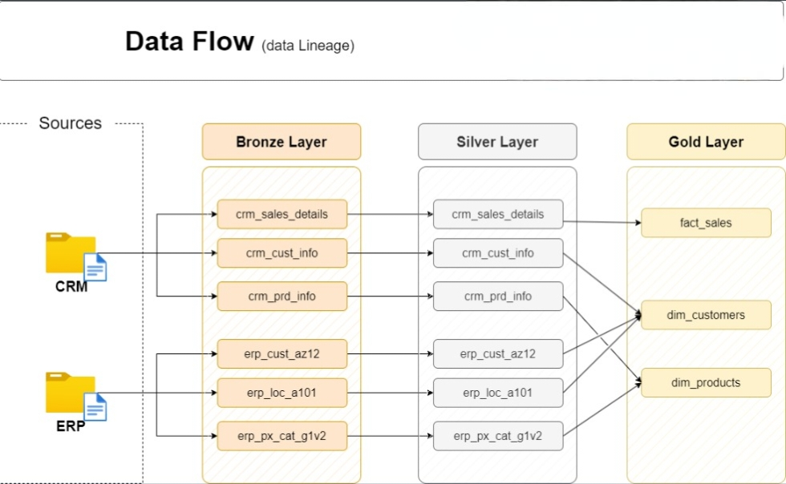

[README.md](https://github.com/user-attachments/files/28522749/README.md)
# SQL Data Warehouse — Medallion Architecture

A end-to-end Data Warehouse built on **SQL Server**, consolidating data from two source systems (CRM and ERP) through a three-layer **Medallion Architecture** (Bronze → Silver → Gold) into an analytics-ready Star Schema.

---

## Architecture



The warehouse is structured across three layers, each with a distinct responsibility:

| Layer | Object Type | Load Strategy | Purpose |
|-------|-------------|---------------|---------|
| **Bronze** | Tables | Truncate & Insert (Full Load) | Raw ingestion — data stored as-is from source |
| **Silver** | Tables | Truncate & Insert (Full Load) | Cleansed, standardized, and normalized data |
| **Gold** | Views | No load (query-time) | Business-ready Star Schema for analytics |

---

## Data Flow



Six source tables across two systems flow through all three layers:

**CRM** → `crm_sales_details`, `crm_cust_info`, `crm_prd_info`  
**ERP** → `erp_cust_az12`, `erp_loc_a101`, `erp_px_cat_g1v2`

---

## Data Model


The Gold layer exposes a **Sales Data Mart** built as a Star Schema with three views:

- **`gold.dim_customers`** — Customer demographics enriched from CRM + ERP (country, birthdate, marital status, gender)
- **`gold.dim_products`** — Product catalogue with category, subcategory, product line, and maintenance flag
- **`gold.fact_sales`** — Sales transactions linked to both dimensions via surrogate keys

> `sales_amount = quantity × price`

---

## Data Integration


The integration diagram shows how source tables relate across systems — CRM provides transactional and master data; ERP enriches it with location and product category data.

---

## Project Structure

```
sql-data-warehouse-project/
│
├── datasets/               # Source CSV files (CRM and ERP)
│
├── docs/
│   ├── data_architecture.jpeg
│   ├── data_flow.jpeg
│   ├── data_integration.jpeg
│   ├── data_model.jpeg
│   ├── data_catalog.md         # Column-level documentation for Gold layer
│   └── naming_conventions.md   # Naming standards for tables, columns, procedures
│
├── scripts/
│   ├── setup/
│   │   ├── 01_create_database.sql
│   │   └── 02_load_layers.sql
│   │
│   ├── bronze/
│   │   ├── 01_create_crm_tables.sql
│   │   ├── 02_create_erp_tables.sql
│   │   └── 03_load_bronze.sql       # Stored procedure: load_bronze
│   │
│   ├── silver/
│   │   ├── 01_create_crm_tables.sql
│   │   ├── 02_create_erp_tables.sql
│   │   └── 03_load_silver.sql       # Stored procedure: load_silver
│   │
│   └── gold/
│       ├── ddl_gold_dim_customers.sql
│       ├── ddl_gold_dim_products.sql
│       └── ddl_gold_fact_sales.sql
│
├── tests/
│   ├── quality_checks_silver.sql
│   └── quality_checks_gold.sql
│
└── README.md
```

---

## ETL Pipeline

### 1. Setup
Create the database and initialize the three schema layers (`bronze`, `silver`, `gold`).

### 2. Bronze — Raw Ingestion
Tables are created to mirror source structure exactly. Data is loaded via `BULK INSERT` from CSV files using the `load_bronze` stored procedure (full load, truncate & insert).

### 3. Silver — Cleanse & Standardize
The `load_silver` stored procedure applies:
- Null handling and default substitution
- Data type corrections and format standardization
- Deduplication (most recent record per key)
- Derived columns and business rule transformations
- Data normalization across CRM and ERP tables

### 4. Gold — Star Schema Views
Views in the Gold layer join and aggregate Silver tables into business-ready objects. No physical load — results are computed at query time.

---

## Data Quality

Quality check scripts validate both the Silver and Gold layers before consumption:

- `tests/quality_checks_silver.sql` — checks on cleaned source tables
- `tests/quality_checks_gold.sql` — checks on dimension and fact views

---

## Tech Stack

- **SQL Server** — database engine
- **T-SQL** — all ETL logic, stored procedures, and views
- **SSMS** — development and execution environment
- **Draw.io** — architecture and data model diagrams
- **Git / GitHub** — version control

---

## Documentation

| Document | Description |
|----------|-------------|
| [`data_catalog.md`](docs/data_catalog.md) | Column-level metadata for all Gold layer views |
| [`naming_conventions.md`](docs/naming_conventions.md) | Naming standards for schemas, tables, columns, and stored procedures |

---

## Author

**Dhwanit Bodiwala**  
Computer Engineering Student · Aspiring Data Engineer  
[github.com/dhwanit-bodiwala](https://github.com/dhwanit-bodiwala)

---

## License

This project is licensed under the [MIT License](LICENSE).
