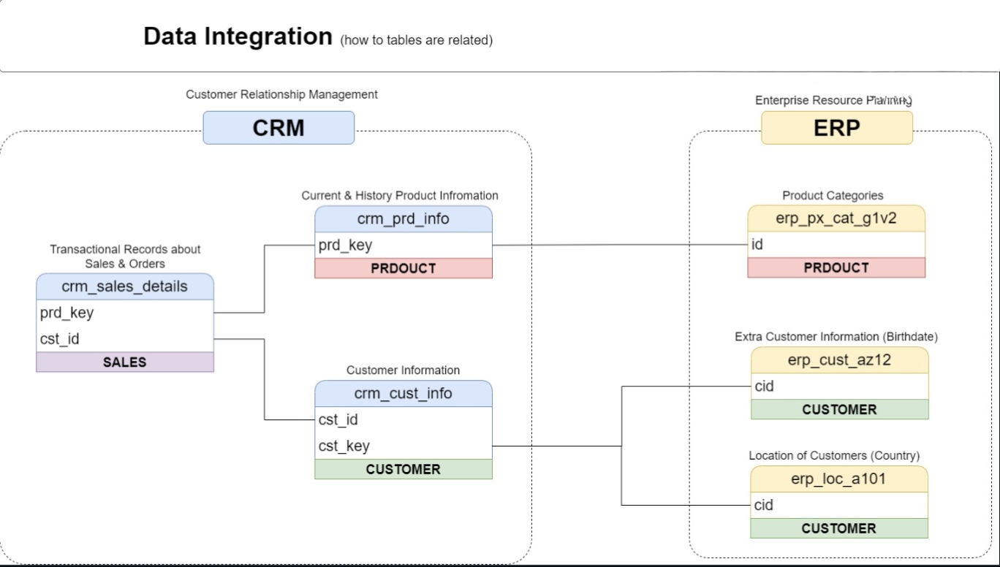
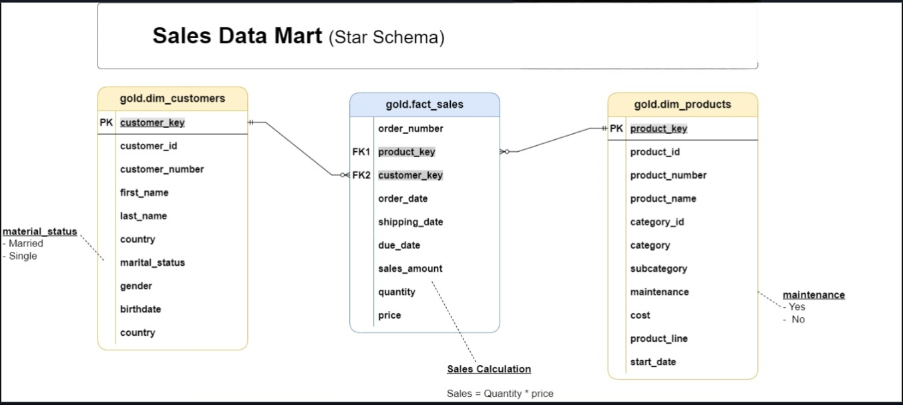

# Data Warehouse — Medallion Architecture

An end-to-end ETL pipeline built on **SQL Server** that ingests raw CRM and ERP source data through a three-layer **Medallion Architecture** (Bronze → Silver → Gold) into an analytics-ready Star Schema.

This is **Project 1 of 3** in this repository. The Gold layer produced here is consumed directly by the EDA and Advanced Analytics projects.

---

## Architecture


| Layer | Object Type | Load Strategy | Purpose |
|-------|-------------|---------------|---------|
| **Bronze** | Tables | Truncate & Insert (Full Load) | Raw ingestion — data stored as-is from source |
| **Silver** | Tables | Truncate & Insert (Full Load) | Cleansed, standardized, and normalized data |
| **Gold** | Views | No load (query-time) | Business-ready Star Schema for analytics |

---

## Data Sources



Six source tables across two systems:

**CRM** → `crm_sales_details`, `crm_cust_info`, `crm_prd_info`  
**ERP** → `erp_cust_az12`, `erp_loc_a101`, `erp_px_cat_g1v2`

---

## Data Flow


Raw CSVs → Bronze (BULK INSERT) → Silver (stored procedure transformations) → Gold (views)

---

## Data Model



The Gold layer exposes a **Sales Data Mart** as a Star Schema:

| View | Description |
|------|-------------|
| `gold.dim_customers` | Customer demographics enriched from CRM + ERP (country, birthdate, marital status, gender) |
| `gold.dim_products` | Product catalogue with category, subcategory, product line, and maintenance flag |
| `gold.fact_sales` | Sales transactions linked to both dimensions via surrogate keys |

> `sales_amount = quantity × price`

---

## Project Structure

```
data_warehouse/
│
├── docs/
│   ├── data_architecture.jpeg
│   ├── data_flow.jpeg
│   ├── data_integration.jpeg
│   ├── data_model.jpeg
│   ├── data_catalog.md         # Column-level documentation for Gold layer views
│   └── naming_conventions.md   # Naming standards for schemas, tables, and procedures
│
├── scripts/
│   ├── setup/
│   │   ├── 01_create_database.sql   # Creates DataWarehouse DB and bronze/silver/gold schemas
│   │   └── 02_load_layers.sql       # Executes load_bronze and load_silver procedures
│   │
│   ├── bronze/
│   │   ├── 01_create_crm_tables.sql # CRM raw tables (cust_info, prd_info, sales_details)
│   │   ├── 02_create_erp_tables.sql # ERP raw tables (cust_az12, loc_a101, px_cat_g1v2)
│   │   └── 03_load_bronze.sql       # Stored procedure: bronze.load_bronze (BULK INSERT)
│   │
│   ├── silver/
│   │   ├── 01_create_crm_tables.sql # CRM cleansed tables
│   │   ├── 02_create_erp_tables.sql # ERP cleansed tables
│   │   └── 03_load_silver.sql       # Stored procedure: silver.load_silver (transform + load)
│   │
│   └── gold/
│       ├── ddl_gold_dim_customers.sql  # Customer dimension view
│       ├── ddl_gold_dim_products.sql   # Product dimension view
│       └── ddl_gold_fact_sales.sql     # Sales fact view
│
└── tests/
    ├── quality_checks_silver.sql   # Null, duplicate, and standardization checks on Silver
    └── quality_checks_gold.sql     # Surrogate key uniqueness and referential integrity checks
```

---

## ETL Pipeline

### 1. Setup
Creates the `DataWarehouse` database and initializes the three schemas (`bronze`, `silver`, `gold`).

### 2. Bronze — Raw Ingestion
Tables mirror source structure exactly. Data is loaded via `BULK INSERT` from CSV files using the `bronze.load_bronze` stored procedure — full load, truncate & insert on every run.

### 3. Silver — Cleanse & Standardize
The `silver.load_silver` stored procedure applies:
- Null handling and default substitution
- Data type corrections and format standardization
- Deduplication (most recent record per key)
- Derived columns and business rule transformations
- Normalization across CRM and ERP tables

### 4. Gold — Star Schema Views
Views in the Gold layer join and aggregate Silver tables into business-ready objects. No physical load — computed at query time.

**Business rules applied:**
- CRM is the primary source for both customer and product data
- ERP enriches customer records (birthdate, location, demographics)
- ERP gender is used only when CRM gender is unavailable
- Only current/active products are included in `dim_products`

---

## Data Quality

Quality checks validate both layers before downstream consumption:

| Script | Checks |
|--------|--------|
| `quality_checks_silver.sql` | Nulls, duplicates, unwanted spaces, invalid date ranges, cross-field consistency |
| `quality_checks_gold.sql` | Surrogate key uniqueness, referential integrity between fact and dimensions |

---

## Documentation

| Document | Description |
|----------|-------------|
| [`data_catalog.md`](docs/data_catalog.md) | Column-level metadata for all three Gold layer views |
| [`naming_conventions.md`](docs/naming_conventions.md) | Naming standards for schemas, tables, columns, and stored procedures |

---

## Tech Stack

- **SQL Server** — database engine
- **T-SQL** — ETL logic, stored procedures, and views
- **SSMS** — development and execution environment
- **Draw.io** — architecture and data model diagrams
